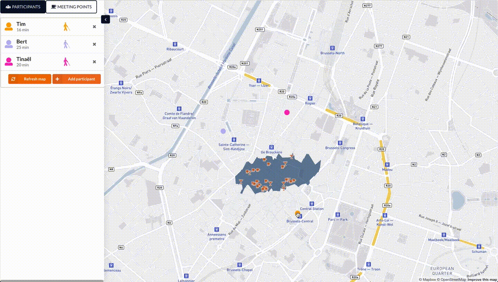

# [HorISOn](https://horison-map.be) &middot; 

HorISOn helps small groups of people find a suitable meeting location.

* **Personal:** Based on your preferred mode of transport, available time and interests!
* **Client-based:** All of our computations are done on the client side, no
  pesky time-outs for expensive queries!
* Powered by Linked Open Data and [OpenPlanner Team](https://openplanner.team/)'s [planner.js](https://planner.js.org/)
  library.

## Authors

* **Tinaël Devresse** - *Student* - [GitHub Profile](https://github.com/hunteroi)
* **Bert Schoovaerts** - *Student* - [GitHub Profile](https://github.com/bertschoovaerts)
* **Tim Baccaert** - *Student* - [GitHub Profile](https://github.com/timutable)

## License

This project is licensed under the MIT License - see the
[LICENSE.md](LICENSE.md) file for details

## Acknowledgments

* Made with love at [Open Summer of Code 2019](https://osoc.be/2019)
* Hat tip to **Harm Delva**, **Tim Van Hee**, **Julian Rojas** and **Pieter
  Colpaert** for making this project possible.

